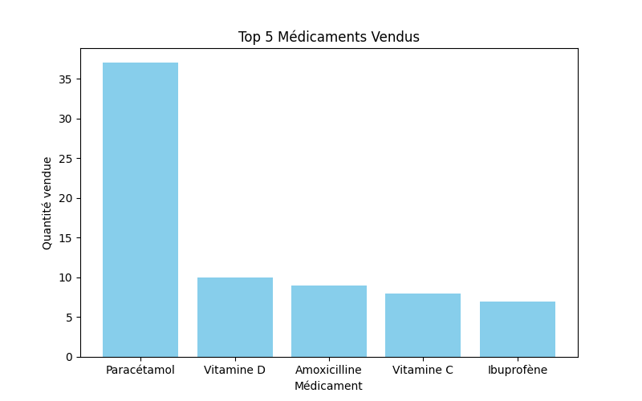
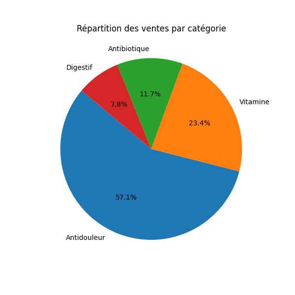
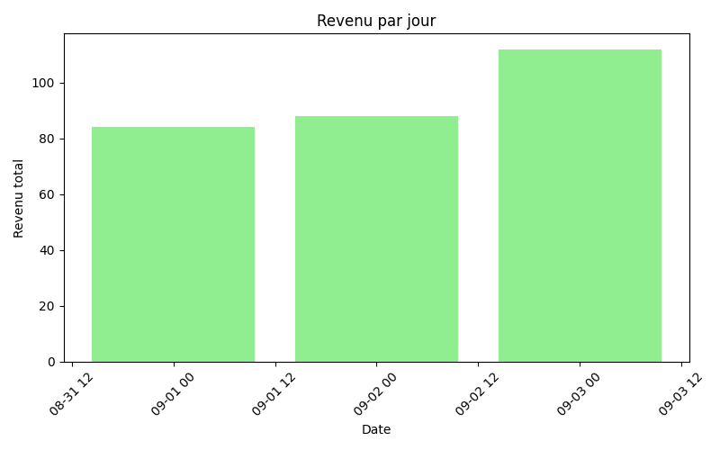
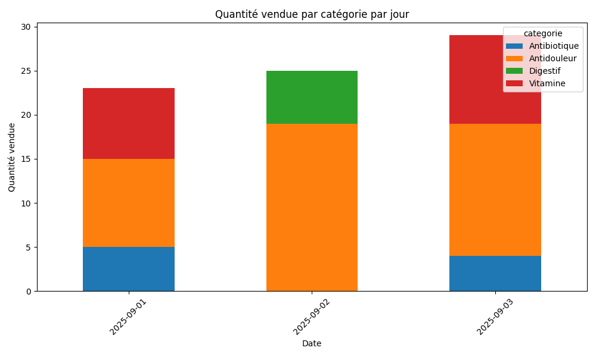

# 🏥 Pharmacy Sales Analysis with PySpark

  

This project analyzes pharmacy sales using **PySpark** for big data processing and **Matplotlib** for visualization. It provides useful insights for stock management and sales planning.

---

## 📊 Features
- Analysis of the **best-selling medication**
- Analysis of the **most demanded category** (antibiotics, vitamins, painkillers, etc.)
- Calculation of **daily revenue**
- Graphical visualization of sales:
  - **Histogram**: Top 5 sold medications  
  - **Pie chart**: Sales distribution by category  
  - **Histogram**: Daily revenue  
  - **Stacked bar chart**: Quantity sold by category per day  

---

### Top 5 Sold Medications


### Sales Distribution by Category


### Daily Revenue


### Quantity Sold by Category per Day


---

## 💡 Possible Insights
- Identify **the most profitable products** to optimize orders.
- Spot **the days with the highest sales** to adjust staffing.
- Observe **seasonal trends** in category sales.
- Assist with **stock planning** to prevent shortages or overstock.

---

## 🚀 Running the Project
1. Clone the repository
   ```bash
   git clone https://github.com/aleeaouini/pharmacy-analysis.git
   cd pharmacy-analysis
